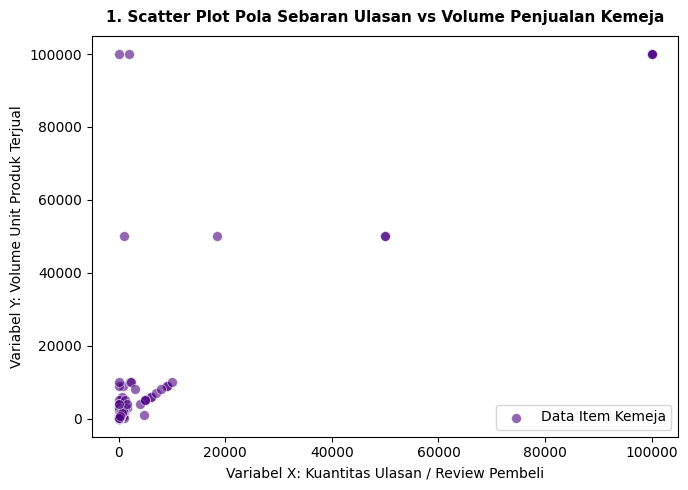
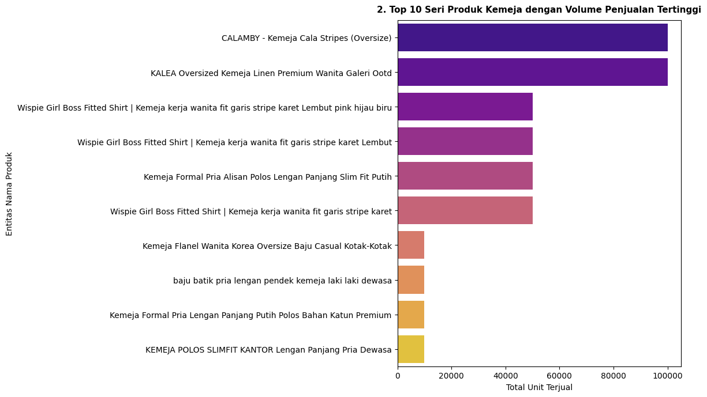
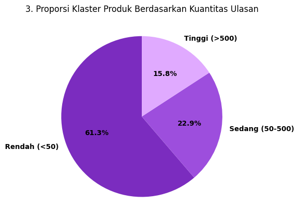
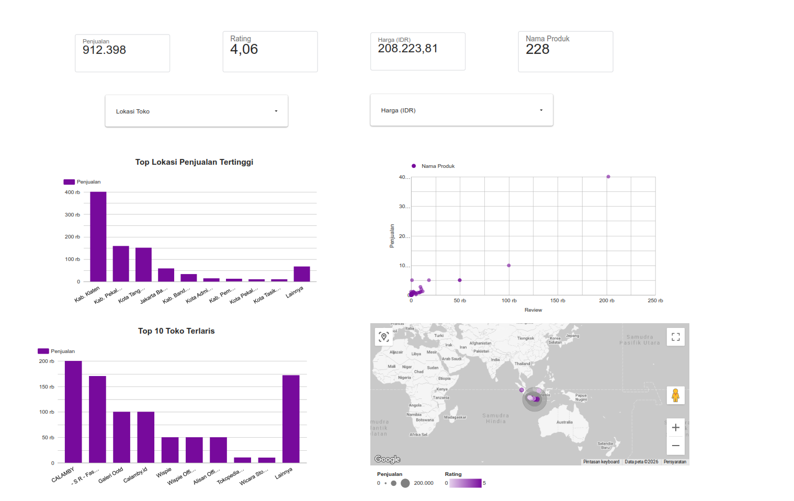

# Analitik, Korelasi, dan Regresi Linear pada Data Produk Kemeja di Marketplace

Studi kasus: hubungan antara jumlah ulasan (review) dan volume penjualan produk kemeja di marketplace, menggunakan pipeline Big Data end-to-end — mulai dari pengumpulan data, pembersihan, analitik deskriptif, korelasi, regresi linear, hingga insight dan rekomendasi keputusan bisnis.

## Ringkasan Project

- **Sumber data:** Dataset publik dari Kaggle — [Indonesia E-Commerce Dataset (Tokopedia Listings)](https://www.kaggle.com/datasets/pandaa12/indonesia-e-commerce-dataset-tokopedia-listings)
- **Fokus kategori:** Produk "Kemeja" saja (menghindari bias korelasi/regresi akibat karakteristik harga & pembeli yang beda jauh antar kategori)
- **Pertanyaan analisis:**
  1. Apakah semakin banyak review, semakin tinggi penjualan?
  2. Seberapa kuat hubungan antara jumlah review dan penjualan?
  3. Bisakah penjualan diprediksi berdasarkan jumlah review?

## Alur Pipeline

1. **Pengumpulan data** — unduh dataset produk dari Kaggle
2. **Pembersihan data** — konversi kolom teks ("1rb+ terjual", "250+ ulasan") menjadi angka, buang baris dengan format tidak jelas ("Unknown")
3. **Penyimpanan data** — simpan data bersih ke CSV (`dataset_dashboard_penjualan_looker.csv`) untuk divisualisasikan di Looker Studio
4. **Analitik deskriptif** — mean, median, modus, min, max, range, standar deviasi
5. **Visualisasi** — scatter plot, bar chart, pie chart
6. **Korelasi** — Pearson correlation antara Review dan Penjualan
7. **Regresi linear** — model prediksi `Y = a + bX`
8. **Insight & keputusan bisnis** — interpretasi hasil dan rekomendasi strategi

## Hasil Utama

| Metrik | Nilai |
|---|---|
| Korelasi Pearson (r) | **0.7768** (Positif, Kuat) |
| Persamaan regresi | Y = 1482.37 + 1.0027X |
| R-squared (R²) | 0.6034 (60.3%) |
| Contoh prediksi | Produk dengan 300 review → ±1.783 unit terjual |
| Jumlah data valid | 253 dari 269 produk kemeja |

**Insight kunci:**
- Hubungan jumlah review dan penjualan **positif dan kuat** — review terbukti jadi sinyal penting, tapi bukan satu-satunya faktor (60.3% variasi penjualan dijelaskan oleh review, sisanya kemungkinan harga, rating, atau promosi)
- Distribusi data **sangat skewed** — mayoritas produk penjualannya kecil, beberapa produk "viral" menarik rata-rata jadi tinggi
- Penjualan kategori ini **terkonsentrasi**: hanya 9 dari 253 produk menyumbang ±76.7% total penjualan kategori

**Rekomendasi bisnis:** dorong pengumpulan review lewat insentif, jangan cuma andalkan review untuk produk baru (optimalkan harga & foto dulu), replikasi pola dari produk yang sudah terbukti laris, dan gunakan model regresi sebagai estimasi awal (dengan margin aman) untuk perencanaan stok.

## Visualisasi

| Scatter Plot | Top 10 Produk |
|---|---|
|  |  |

| Distribusi Kategori Review |
|---|
|  |

## Dashboard Looker Studio

Data yang sudah dibersihkan juga divisualisasikan sebagai dashboard interaktif di Google Looker Studio (metrik penjualan, rating, harga, sebaran lokasi toko, dan scatter review vs penjualan).



## Tools & Library

- Python
- Pandas — manipulasi & pembersihan data
- Matplotlib & Seaborn — visualisasi data
- Scikit-learn & NumPy — korelasi dan regresi linear
- Google Looker Studio — dashboard interaktif

## Setup

```bash
pip install -r requirements.txt
```

Notebook ini bisa dijalankan di **Google Colab** maupun secara lokal (Anaconda/Jupyter Notebook). Langkah-langkahnya:
1. Unduh dataset dari link Kaggle di atas, taruh sebagai `produk_tokopedia.csv` di folder yang sama dengan notebook
2. Jalankan notebook `notebook/big_data_analytics_correlation_regression.ipynb`

> Catatan: notebook memakai `from google.colab import files` untuk auto-download file CSV & grafik hasil. Kalau dijalankan di luar Colab (misal Anaconda/Jupyter lokal), baris `files.download(...)` bisa dihapus/dikomentari saja — file CSV dan grafik tetap otomatis tersimpan ke folder lokal lewat `to_csv()` dan `savefig()`.

## Struktur Project

```
.
├── notebook/
│   └── big_data_analytics_correlation_regression.ipynb
├── assets/              # grafik hasil analisis & screenshot dashboard
├── requirements.txt
└── .gitignore
```

## Catatan

- Dataset mentah dan dataset hasil cleaning tidak diikutsertakan dalam repo ini (lihat `.gitignore`) — bisa diunduh ulang dari link Kaggle atau di-generate ulang dengan menjalankan notebook.
- Korelasi dan regresi pada studi ini menunjukkan **pola kecenderungan**, bukan hubungan sebab-akibat yang mutlak.
